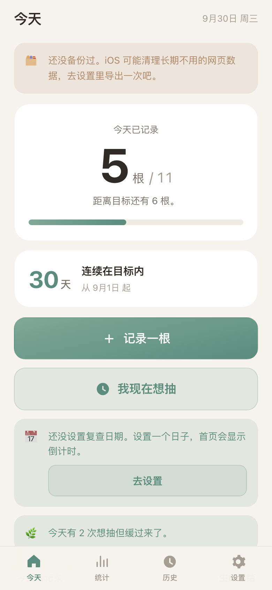

# 吸烟记录

一个个人用的吸烟追踪 PWA。记录每天抽了几根、什么场景、当时情绪，用**温和**的方式慢慢减少——不评判、不告警、不用红色。

数据只存在你自己的手机上，没有账号、没有后端、不上传任何地方。



---

## 部署到 GitHub Pages（两种路径，选一个）

### 路径 A：手边有电脑 —— 拖文件（推荐，2 分钟）

不需要终端、不需要 Token、不需要 SSH key。

1. 打开 <https://github.com/new>
2. **Repository name** 填 `smoke-tracker`，选 **Public**，点 **Create repository**
3. 在空仓库页面点 **Add file** → **Upload files**
4. 把 `smoke-tracker` 文件夹里的这几个文件拖进浏览器的上传区域：
   - `index.html`
   - `sw.js`
   - `manifest.json`
   - `icon-180.png`
   - `.nojekyll`
5. 点 **Commit changes**
6. 进仓库 **Settings** → 左侧 **Pages**
7. **Source** 选 `Deploy from a branch`，**Branch** 选 `main` + `/ (root)`，点 **Save**
8. 等 1–2 分钟，页面顶部会出现网址：**`https://<你的用户名>.github.io/smoke-tracker/`**

完事。以后不需要再碰电脑。

### 路径 B：只有 iPhone

在手机 Safari 里操作，全程网页版。

1. 打开 <https://github.com/new>，仓库名填 `smoke-tracker`，选 **Public**，创建
2. 点 **Add file** → **Create new file**
3. 文件名填 `index.html`
4. 粘贴文件内容（见下面「怎么把内容弄到手机上」）
5. 拉到最下面点 **Commit changes**
6. 重复第 2–5 步，再建一个 `sw.js`
   - **这两个文件是必须的。** `manifest.json` 和 `icon-180.png` 可选（图标已经内联在 `index.html` 里了）
7. **Settings** → **Pages** → Source 选 `main` / `/ (root)` → **Save**
8. 等 1–2 分钟，得到 `https://<你的用户名>.github.io/smoke-tracker/`

#### 怎么把内容弄到手机上

`index.html` 有 97 KB，手打不可能。几个办法：

- **用 Mac 的复制助手**（就在这个文件夹里）：先在 Mac 上跑 `./serve.sh`，然后用手机 Safari 打开
  `http://<Mac的局域网IP>:8888/copy-helper.html`，上面有「复制 index.html」按钮，点一下内容就进剪贴板了，
  再切到 GitHub 粘贴。
- **AirDrop**：把 `index.html` 隔空投送到 iPhone，用备忘录或「文件」打开，全选复制。
- **邮件给自己**：把文件作为附件发到自己的邮箱，在手机上打开附件复制内容。

---

## 装到 iPhone 主屏幕

1. iPhone Safari 打开你的 GitHub Pages 网址
2. 点底部中间的 **分享** 按钮
3. 往下滑，点 **添加到主屏幕**
4. 点右上角 **添加**

从主屏幕图标启动就是全屏 App，没有地址栏，断网也能用。

> 第一次打开后**停留几秒**让 Service Worker 把文件缓存下来，之后就能离线了。
> 想确认：App 里「设置 → 运行状态」，看「离线缓存」是不是「已激活」。

---

## 功能

### 今天
- 大字显示**今天已记录根数**和当日目标
- **连续在目标内**的天数
- 两个大按钮：**记录一根** / **我现在想抽**
- **距离下次复查的天数**（复查日期在设置里填）
- 今天的流水，点任意一条可以编辑或删除
- 一键**生成今日总结**并复制

### 记录一根
自动填当前时间（可改）、选场景标签、情绪打分 1–5、可选备注。

### 我现在想抽
全屏缓冲页：倒计时（默认 60 秒，可设 30/60/90/120/180 秒），期间随机显示你自定义的提醒语。
倒计时结束后问「还想记录一根吗？」——
- 选「想抽，记录一根」→ 打开记录表单
- 选「不抽了」→ 记一次「缓过来」，统计页有专门的趋势图

### 目标模式
- 每日上限可调（0–60 根）
- 可开启**每周自动递减 1 根**，减到设定的下限为止
- 超标时只说「比今天的目标多 N 根，记下来就好」——**没有任何羞耻、警告或红色**

### 统计
- 近 30 天每日根数柱状图，橙色虚线是当日目标
- 场景占比环形图
- 一天中的时段分布（24 小时）
- 「缓过来」次数趋势
- **喉咙状态 × 根数对照**：上下双图共享日期轴，并给出「喉咙不舒服的日子平均抽几根」的结论

### 身体反馈
每天可以记一次喉咙状态 1–5 分 + 一句话，在统计页和当天的根数对照展示。

### 历史
按天列表，显示当天根数 / 目标 / 缓过来次数 / 喉咙状态，展开可编辑删除每一条。

### 设置
每日上限、自动递减、复查日期、缓冲时长、**提醒语增删**、**场景标签增删**、外观（跟随系统/浅色/深色）、数据导入导出、运行状态自检。

---

## 备份（重要）

所有数据存在 `localStorage` 里，**只在这台手机上**。

> **iOS 可能清理长期不用的网页数据，请每周备份一次。**

- 首页超过 7 天没备份会自动出现提醒
- 设置页有常驻提示和「上次备份：N 天前」
- 「导出 JSON 备份」会下载一个文件，建议存到 iCloud Drive
- 换手机或重装后用「导入 JSON 恢复」

---

## 文件结构

```
smoke-tracker/
├── index.html          # 整个 App：结构 + 样式 + 逻辑 + 内联图标（97 KB，唯一必需的文件）
├── sw.js               # Service Worker，负责离线缓存
├── manifest.json       # PWA 清单（iOS 其实读的是 meta 标签，这个是为其他平台准备的）
├── icon-180.png        # 主屏幕图标（已内联进 index.html，这个文件是冗余保险）
├── .nojekyll           # 告诉 GitHub Pages 别跑 Jekyll
├── copy-helper.html    # 开发辅助：把文件内容复制到手机剪贴板，不用上传
├── make_icon.py        # 生成图标的脚本
├── serve.sh            # 本地预览服务器
├── test.mjs            # 端到端测试
└── shots/              # 测试截图
```

**技术栈：零依赖。** 没有 npm、没有构建步骤、没有框架、没有 CDN。CSS 和 JS 全部内联在 `index.html` 里，
所以只需要上传一个文件就能跑。

---

## 测试

```bash
./serve.sh &                       # 起服务器
node test.mjs                      # 需要装了 Google Chrome
```

`test.mjs` 用 Node 内置的 `WebSocket` 直接驱动 Chrome DevTools Protocol，**不需要任何 npm 依赖**。
它会走完 55 项检查，包括：

- PWA 必需的 meta 标签和 manifest
- 记录 / 编辑 / 删除一条
- 完整的缓冲流程（倒计时 → 提问 → 两条分支都测）
- 今日总结的内容和剪贴板接线
- 喉咙状态保存
- 播种 30 天数据后统计页的 4 个图表、环形图，以及**断言页面里不出现任何红色值**
- 历史页渲染与展开
- 设置页所有控件（步进器、开关、增删提醒语和标签、主题切换）
- 导出 JSON 结构、跨刷新持久化、Service Worker 激活、**断网冷启动**
- 浅色 / 深色两套主题的视觉截图

当前状态：**55/55 通过，零 console 错误。**

---

## 免责

这是个自我记录工具，不是医疗建议。如果你烟龄较长或每天数量较多，想减量之前可以先问问医生，
尼古丁替代疗法（贴片、口香糖）在减量过程中通常比单靠意志力有效得多。
